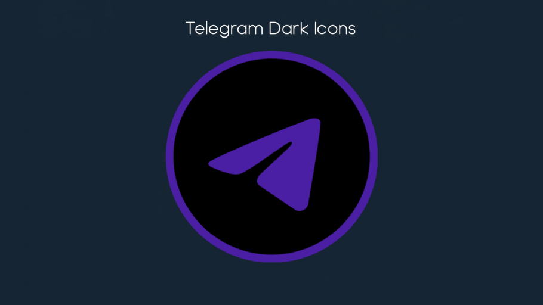

# Telegram Dark Icons
A set of more modern icons for the Telegram messenger.

## Icon preview

## How to apply

### macOS
1. Click on `Finder` and navigate to your `Applications` directory. 
1. Right click or secondary tap on `Telegram` and select `Get Info`.
1. Drag and drop your selected icon (e.g. `purple-icon.icns`) onto the previous icon's preview window.
1. Restart `Telegram` to apply the changes.

### GNU/Linux
> The implementation of the specified steps in this section might slightly differ across distributions due to dissimilar names of settings. The primary motive of changing the app's icon remains the same. 
1. Right click on the Telegram application.
1. Select `Edit Application`.
1. In the `Edit Launcher` settings menu click on`Icon:`.
1. From the prompt click on `Select icon from` > `Image Files`.
1. Browse to the cloned directory where you have the `` file saved.
1. Click on `OK`.
1. Now in the `Edit Launcher` settings menu apply the changes by clicking on the `save` settings button.
1. Restart `Telegram` if it was running.

### Microsoft Windows
1. Open the `Start` menu from the taskbar.
1. Locate the `Telegram` entry (Alphabetically arranged list).
1. Right click on `telegram` > `More` > `Open File Location`, a new `File Explorer` window will open up.
1. Inside the Folder right click on Telegram's shortcut > `Properties` > `Change Icon` > `Browse`.
1. Locate the file  and select it.
1. Hit `OK` and then `Apply`.
> If you already had Taskbar entry for `Telegram` remove it buy right clicking > `Remove` and make a new entry by going to `Start` > right click on `Telegram` > `More` > `Pin to Taskbar`.